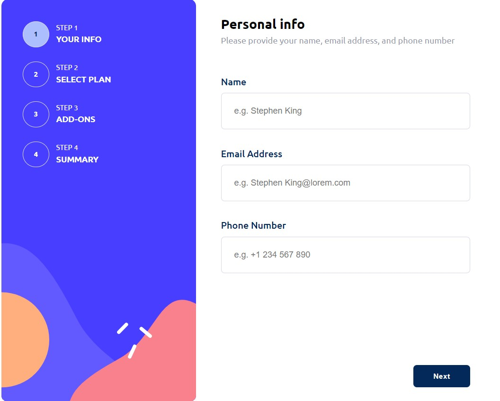

# Frontend Mentor - Multi-step form solution by Renata

This is a solution to the [Multi-step form challenge on Frontend Mentor](https://www.frontendmentor.io/challenges/multistep-form-YVAnSdqQBJ).

## Multi-Step Form Practice with React

This project is dedicated to refining React skills, specifically practicing the useContext() and useReducer() hooks. The aim was to leverage useContext() to eliminate prop drilling and utilize useReducer() to consolidate the application logic within a single file/function.

## Overview

The purpose of this project was to create a multi-step form specifically tailored for desktop interfaces. By focusing on React Hooks, particularly useContext() and useReducer(), the goal was to enhance proficiency with these tools while building a practical application.

### The challenge prerequisites

Users are able to:

- Complete each step of the sequence
- Go back to a previous step to update their selections
- See a summary of their selections on the final step and confirm their order
- See hover and focus states for all interactive elements on the page

### Screenshot

### Links

- Solution URL: [Add solution URL here](https://github.com/An-Renata/multi-step-form)
- Live Site URL: [Add live site URL here](https://incomparable-sunburst-3f100a.netlify.app/)

### Built with

- Semantic HTML5 markup
- CSS custom properties
- Flexbox
- CSS Grid
- [React](https://reactjs.org/) - JS library
- [Styled Components](https://styled-components.com/) - For styles

### Key Features

React Hooks Utilization: Demonstrates effective use of useContext() and useReducer() hooks.
Desktop Interface: Designed for desktop-only use to streamline development efforts.
Consolidated Logic: Centralized application logic within a single file/function for improved maintainability

### Installation

To get started with this project, follow these steps:

1. Clone this repository to your local machine.
2. Install dependencies using `npm install`.
3. Run the application using `npm start`.

### Contributing

Contributions to this project are welcome! If you have suggestions, enhancements, or bug fixes, feel free to submit a pull request.
